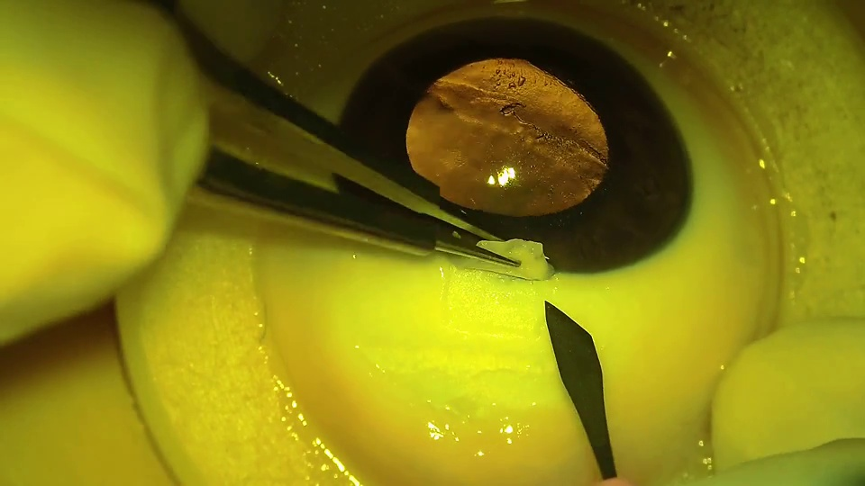
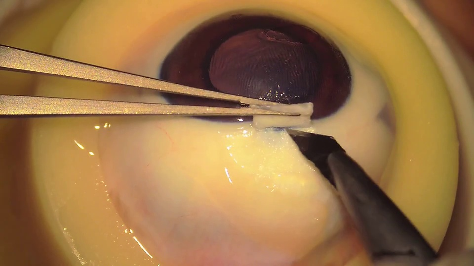

# Criteria-Grounded Surgical Skill Assessment

Code and qualitative examples for our ICASSP 2027 submission:

**Criteria-Grounded Surgical Skill Assessment: A Multimodal Reasoning Framework**

We assess surgical skill as a mapping from **video + scoring criteria** to a **score**.  

This repository currently hosts **visualizations**. Code and dataset will be added here.

---

**Example images** and **ground-truth scores** are from our dataset.

**Predictions** are from the outputs of our framework using Qwen3-VL-Flash and Qwen3.8-Flash. The predicted scores and reasons are the output of the criteria grounding module. The descriptions are the output of the exemplar learning module.

**Plain descriptions** are the outputs of Qwen3-VL-Flash using _``This is an image of trabeculectomy practice. Describe this image for skill assessment.''_ as prompt. We observe that the plain descriptions tend to be more appearance-oriented, use imprecise terminology, and contain errors.

---

## Qualitative Example 1

### 1. Example image (key frames)

  

### 2. Ground-truth score

**GT score: 3**

### 3. Prediction (ours)

**Predicted score: 3**

**Reason:** No toothed forceps, no tearing occurred. Size ≈ 4×3 mm, relatively regular margins, tending to grade 4; relatively thin and posteriorly sectioned, tending to grade 3. The lower grade is adopted, resulting in a final grade of 3.

**Description:** 

Instrument: Toothless forceps

Margin: Relatively regular

Size: approximately 4×3 mm (closest to Example 2)

Thickness: slightly uneven and relatively thin (closest to Example 2)

Limbus: absent (posterior sectioning)

Tear: none

### 4. Plain description

This image presents a simulated surgical practice scene of trabeculectomy, used to assess trainees’ basic operative skills in glaucoma filtering surgery. The following professional description is provided from the perspective of surgical skill evaluation for teaching assessment or examination records:

🔹 **Surgical Field and Anatomical Structures**

The center of the image shows an ex vivo bovine eye or high-fidelity ocular model. Clear anterior chamber, iris, lens and scleral regions can be observed. The pupil is dark and round, located slightly superior to the center. The anterior chamber is filled with transparent fluid (simulated aqueous humor), with faint reflections and air bubbles on the surface.

🔹 **Surgical Manipulation Details**

- A pair of delicate needle holders / tissue forceps (black metallic instruments) grasps a small piece of white semitransparent tissue, presumed to be trabecular meshwork / marginal tissue of the scleral flap or filtering bleb-like structure.
  
- Forceps tips are precisely positioned at the anterior chamber angle near the edge of the scleral incision, consistent with the workflow: scleral flap creation → trabecular tissue excision → filtering channel formation.
  
- The instrument is held stably without obvious tremor.
  
🔹 **Pathological / Simulated Features**

- A mixed blue-and-white stained region exists in the scleral area (possibly labelled by fluorescein or methylene blue).
  
- Dark brown patchy deposits are visible in the inferior right quadrant, which may simulate postoperative scarring, inflammatory exudate or "pseudo-filtering bleb occlusion".
  
🔹 **Evaluation Dimensions for Technical Key Points** (anatomical recognition / instrument precision / procedural standardization / simulation adaptability), with positive feedback provided.

✅ **Comprehensive Evaluation**: This practice reaches the intermediate advanced stage. The trainee can independently complete local management of trabecular tissue, yet further reinforcement is required for depth control of the filtering channel and awareness of postoperative anti-scarring management.

---

## Qualitative Example 2

### 1. Example image (key frames)

  

### 2. Ground-truth score

**GT score: 1**

### 3. Prediction (ours)

**Predicted score: 1**

**Reason:** Criterion 1 in decision sequence — the use of micro toothed forceps for holding is identified, directly assigning grade 1, with size/thickness/margin no longer considered. The flap itself would otherwise score 3–4, overridden by the toothed-forceps rule.

**Description:** 

Instrument: micro toothed forceps for scleral flap holding

Margin: relatively regular

Size: slightly small (compared with Example 1, the area is markedly smaller than approximately 4×3 mm yet larger than the "undersized" flaps in Example 3 and Example 4; closest to Example 1)

Thickness: mildly uneven (local thinning is observed; overall thickness fails to meet the uniform 1/2–3/4 thickness criterion, resembling the "mildly uneven and relatively thin" feature in Example 2)

Limbus: no (posterior dissection)

Tear: no tearing

### 4. Plain description

This image shows a simulated surgical scene of trabeculectomy, commonly adopted for skill training of ophthalmology residents and specialists, usually performed on porcine eyes, bovine eyes or artificial eye models. The following professional description is based on clinical skill evaluation criteria and can be used for teaching assessment or operative examination:

🔹 Operating Environment and Instrument Setup

The image exhibits an overall yellow-green tone, indicating potential use of fluorescein staining or specific filtered illumination (e.g., visualization of anterior chamber structures under blue/green light) to enhance tissue contrast, consistent with the visual environment of a "microscope plus filter system" in real surgery.

The surgical field is clear, and complete ocular anatomical layers are visible: limbus, sclera, anterior chamber, iris and lens capsule (the central dark brown circular structure represents the lens or simulated lens).

🔹 Identification of Key Operative Steps

Scleral flap creation: Forceps at the upper left grasp a small segment of incised scleral tissue with regular margins, indicating partial reflection of the scleral flap. A black spatulated instrument (similar to a scleral knife or corneal lamellar knife) below is placed inside the anterior chamber to prepare for or perform scleral flap dissection/trimming.

Anterior chamber maintenance and operative space: The anterior chamber has moderate depth and is well filled with fluid (simulated aqueous humor) without obvious collapse, demonstrating proper control of intraocular pressure by the operator.

Tissue recognition capability: White semitransparent tissue (potentially the trabecular meshwork region or conjunctival flap) is visible, and the forceps gently grasp its margin.

🔹 Strengths in Skill Performance

Good coordination of dual instruments with synchronized manipulation of one forceps and one spatula; movements are gentle and precise without traction or tearing.

Manipulation is centered approximately 2–3 mm posterior to the limbus.

Full glove coverage and clean instrument tips are maintained.

🔹 Suggestions for Improvement

The trabecular band region is not distinctly visualized. Verification is recommended to confirm adequate tissue removal for forming the filtering bleb channel.

Quantitative metrics including operation duration, number of instrument exchanges, and anterior chamber shallowing can be supplemented.

📌 Summary Comment: The trainee demonstrates competent microsurgical performance and anatomical understanding in basic trabeculectomy procedures, can perform scleral flap creation and tissue dissection in a standardized manner with stable and gentle manipulation, meeting skill requirements for the primary training stage. Targeted practice on trabecular meshwork exposure and filtering channel construction is recommended.

---

## Qualitative Example 3

### 1. Example image (key frames)

  

### 2. Ground-truth score

**GT score: 4**

### 3. Prediction (ours)

**Predicted score: 4**

**Reason:** Size and thickness correspond to grade 5; margin description "relatively regular" matches grade 4. The lower grade is selected → 4.

**Description:** 

Instrument: non-toothed forceps

Margin: relatively regular

Size: approximately 4×3 mm (closest to Example 2)

Thickness: uniform, approximately 1/2 to 3/4 of scleral thickness

Limbus: dissection extended to the clear corneal limbus

Tear: no tearing

### 4. Plain description

This image shows a simulated surgical scene of trabeculectomy, which is commonly used for skill training and assessment of ophthalmology residents and specialists. The following is a detailed professional description of image content for clinical skill evaluation:

🔹 Surgical Field and Anatomical Structures

The image displays the anterior chamber incision region of the eyeball under high magnification. Complete anatomical layers of the eyeball can be observed: the centrally located dark brown iris (circular with textured surface), the peripheral semitransparent lens (pale yellowish-white with slight opacification), and the fluid-soaked anterior chamber space. The overall appearance is characteristic of an artificial eye or animal eye model (such as bovine or porcine eye).

🔹 Instrument Manipulation Details

Forceps (upper left): Two delicate metal forceps grasp a white, sponge-like material, presumed to be simulated filtering bleb tissue, conjunctival flap or amniotic membrane patch, with precise grasping at the forceps tips.

Scalpel/Scissors (lower right): A scalpel or microsurgical scissors with a black handle contacts the tissue margin at the instant of cutting/dissection, corresponding to the stage of scleral flap creation or trabecular meshwork exposure.

🔹 Operative Standardization

The operative area is covered with yellow/light amber fluid, yielding a clear and moist surgical field.

Forceps grasp stably and the cutting instrument is precisely controlled, with no obvious tissue tearing or excessive traction.

Points of concern: recognition of the anterior chamber angle (Schlemm’s canal, trabecular meshwork), controllability of incision depth, and gentleness of tissue handling.

📌 Summary Comment: The operator demonstrates sound basic microsurgical skills, can collaboratively complete tissue dissection using forceps and cutting instruments accurately, maintains a favorable surgical field, and achieves stable instrument control. Further training on identifying anatomical structures of the anterior chamber angle is recommended.

---

## Dataset note

Examples come from porcine trabeculectomy practice videos. There are no identifiers, faces, or hospital marks.

