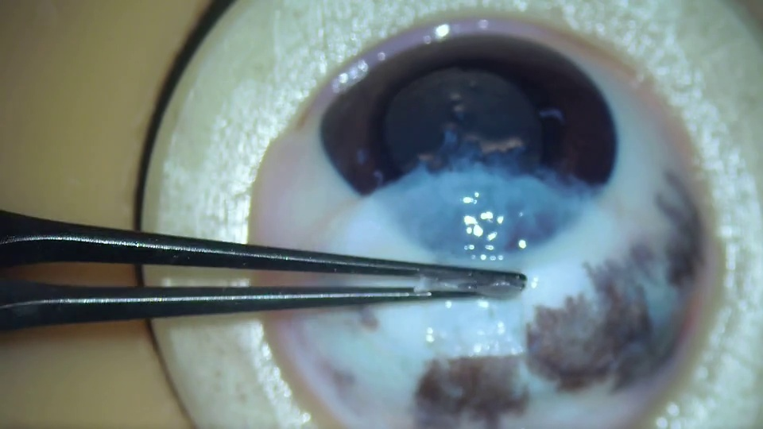

# Criteria-Grounded Surgical Skill Assessment

Code and qualitative examples for our ICASSP 2027 submission:

**Criteria-Grounded Surgical Skill Assessment: A Multimodal Reasoning Framework**

We assess surgical skill as a mapping from **video + scoring criteria** to a **score**.  

This repository currently hosts **visualizations**. Code and dataset will be added here.

---

**Example images** and **ground-truth scores** are from our dataset.

**Predictions** are from the outputs of our framework using Qwen3-VL-Flash and Qwen3.8-Flash. The predicted scores and reasons are the output of the criteria grounding module. The descriptions are the output of the exemplar learning module.

**Plain descriptions** are the outputs of Qwen3-VL-Flash using ``Describe this image for skill assessment.'' as prompt. We observe that the plain descriptions tend to be more appearance-oriented, uses incorrect terminology, and contains errors.

## Qualitative Example 1

### 1. Example image (key frames)

  

### 2. Ground-truth score

**GT score: 3**

### 3. Prediction (ours)

**Predicted score: 3**

**Reason:** No toothed forceps, no tearing occurred. Size ≈ 4×3 mm, relatively regular margins, tending to grade 4; relatively thin and posteriorly sectioned, tending to grade 3. The lower grade is adopted, resulting in a final grade of 3

**Description:** 

Instrument: Toothless forceps

Margin: Relatively regular

Size: approximately 4×3 mm (closest to Example 2)

Thickness: slightly uneven and relatively thin (closest to Example 2)

Limbus: absent (posterior sectioning)

Tear: none

### 4. Plain description

This image displays a surgical/manipulation scene of an artificial or animal eyeball (or ocular tissue model) under a high-power microscope, commonly used for medical education, ophthalmic surgical training or biological experiment teaching. Below is a detailed description from the perspective of professional skill assessment, applicable to evaluating the operator’s proficiency in anatomical cognition, fine manipulation, aseptic awareness and clinical thinking.

---

🔹 **Analysis of Core Image Elements:**

1. **Manipulation Target:**

   - An incised or exposed ocular structure, with intact cornea (transparent anterior segment), iris (dark annular structure), lens region (currently obscured or removed), and posterior pole retina/vitreous cavity observable.
   
   - Pale blue/white turbid material covers the ocular surface — suspected vitreous opacity, artificial gel (e.g., silicone oil or sodium hyaluronate), or simulated postoperative exudate/inflammatory response; dark brown plaques are visible on the right, which may represent retinal hemorrhage, pigmentation or simulated lesional tissue.

2. **Instruments:**
   
   - A pair of precision forceps (e.g., angled ophthalmic forceps or needle holder) grips a small piece of white/semitransparent tissue near the capsular bag or anterior chamber region.
   
   - The forceps feature sharp, slender tips consistent with minimally invasive ophthalmic instruments; black handles with surface reflection indicate fine polishing and cleanliness.

3. **Manipulation Status:**
   
   - The motion is at the "fine grasping" stage rather than rough grabbing, demonstrating awareness for protecting fragile tissues (e.g., lens cortex, vitreous base);
   
   - The forceps are positioned precisely without obvious contact with the cornea or iris margin, indicating sound spatial localization capability of the operator;
   
   - Liquid reflection spots are visible in the background, confirming a liquid environment within the anterior chamber or vitreous cavity (e.g., normal saline or balanced salt solution), consistent with surgical/experimental conditions.

4. **Environmental and Technical Background:**
   
   - The overall image is yellowish-white, possibly resulting from microscope light filter effects or imaging under low-illumination conditions;
   
   - Clear visual field with focus centered on the manipulation site, implying adoption of a high-resolution microscopic system (e.g., surgical microscope or stereomicroscope);
   
   - No obvious blood stains or contamination traces, suggesting basic aseptic principles were followed during manipulation.

---

🔹 **Assessable Skill Dimensions:**

| Dimension | Assessment Criteria |
|------|-----------|
| **Anatomical Recognition** | Accurately identify key structures including cornea, anterior chamber, lens and vitreous, and comprehend their relative spatial relationships; distinguish normal tissue from pathological/simulated lesional regions. |
| **Instrument Manipulation Precision** | Stable and gentle forceps grasping without slippage or tissue tearing; reasonable manipulation trajectory to avoid injury to adjacent vital structures (e.g., pupillary margin, ciliary body). |
| **Operational Standardization** | Appropriate instruments deployed to complete target maneuvers (e.g., lens nucleus extraction, auxiliary vitrectomy); compliance with standard surgical workflows (e.g., continuous curvilinear capsulorhexis or nucleus fragmentation in cataract surgery). |
| **Emergency Response Capacity** | If captured from real surgical video, evaluate timely management of adverse events (e.g., posterior capsule rupture, hemorrhage control); if derived from training models, examine strategy adjustment in response to predefined "complications". |
| **Safety Awareness** | Maintain tissue hydration and intraocular pressure, and prevent hazardous behaviors such as unintended instrument entry beneath the retina; no blind exploration or forceful traction during manipulation. |

---

🔹 **Potential Educational Value and Recommendations:**

- ✅ Suitable for assessing trainee performance on minimally invasive ophthalmic simulation platforms;
  
- ✅ Can serve as an instructional demonstration case for **grasping techniques during lens extraction**;
  
- ⚠️ Supplementary annotations are recommended: manipulation step numbers, tissue labels, intended objectives (e.g., "remove residual cortex"), timestamps, to facilitate standardized scoring sheet construction;
  
- 🔧 For instructional demonstration, arrows/text annotations of key anatomical landmarks may be overlaid on the image to improve learning efficiency.

---

📌 **Summary Comment (Example):** 
> "This image captures a highly refined ophthalmic manipulation. The operator demonstrates strong anatomical recognition and instrument control. Stable forceps grasping with accurate positioning causes no tissue injury, reflecting solid foundational training. Further training on identification and management strategies for 'abnormal tissues' (such as the bluish-white turbid region in the image) is recommended to enhance competency for complex cases."

Customization into concrete scoring rubrics, teaching plans or skill certification templates can be provided upon request.

---

## Dataset note

Examples come from porcine trabeculectomy practice videos. There are no identifiers, faces, or hospital marks.

